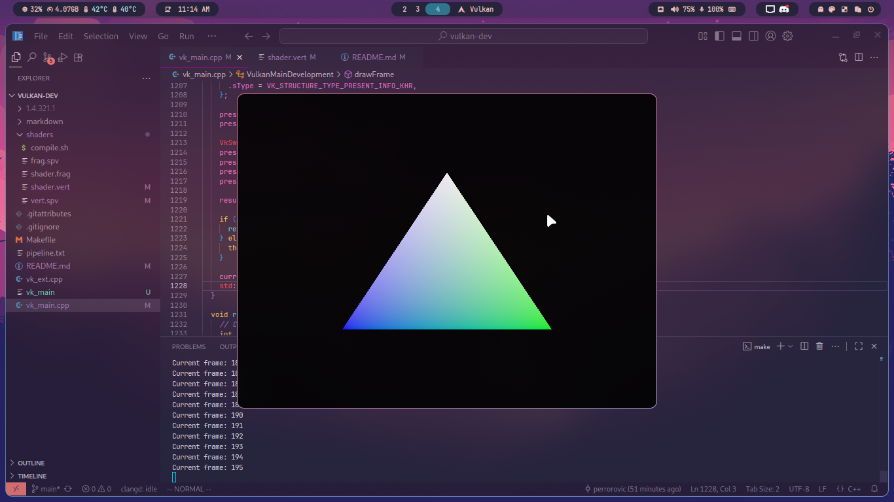

# Vulkan Triangle

Rite of pasage of learing Vulkan API, following along with [Vulkan Tutorial](https://vulkan-tutorial.com)

|Triangle A | Triangle B|
|:-:|:-:|
| | |

Hours spent on this project: 13h (and counting...)

## Overview

Learning Vulkan at itself already something that is hard to get into, expecially with my minimum C++ knowledge, and running all of that on my Linux Wayland + Hyprland compositor?

Yeah, we got proper challange that will sink my morale

This is my journey through that pain and suffering with my personal note of hours wasted, mistake made and wayland shenanigans

My list of suffering along the way

- [Window creation](#window-creation)
- [Wayland support](#wayland-support)
- [Swap chain creation](#swap-chain-creation)
- [Window resize and minimization](#window-resize-and-minimization)

## Window creation

Creating window is as simple as calling GLFW init function, but this window creation will not be displayed by Hyprland if it has no display content (empty draw buffer), which mean this GLFW window is exist but hidden by the compositor

I acknowledge this issues after I tried to draw GLFW window with OpenGL and the window is shown by the compositor

## Wayland support

As I tried to use native support of Wayland in Vulkan as I know that extension exist in my GPU but I quickly found out that extension is disabled on `vulkaninfo`

```text
VK_KHR_wayland_surface: extension revision 6
GPU id : 0 (NVIDIA GeForce GTX 1060 6GB) [VK_KHR_wayland_surface]:
  Surface type = VK_KHR_wayland_surface
    VK_KHR_wayland_surface = false
```

Why it is disabled? I cannot tell myself, It might be because of my NVIDIA proprietary driver (ver. 580) or Hyprland simply said "No"

Therefore moving foward I will be using X11 running under XWayland

## Swap chain creation

This is some issues I encounter when doing `createSwapChain()` to fill requirement data for `VkSwapchainCreateInfoKHR`

This happen because my dumbass forget to actually query the physical device capabilities with `vkGetPhysicalDeviceSurfaceCapabilitiesKHR()` in `querySwapChainSupport()`

The workaround below are fixed with the proper solution after I recognize this mistake, nevertheless this is my past insight on those issues

### Width and height

Vulkan use `chooseSwapExtent()` which return `VkExtent2D` information that hold width and height of the window, this might sometimes adjusted accordingly with high DPI monitor or system zoom scaling

This dynamic adjustment is absolutely broken on Hyprland as it return garbage/trash value for width/height from `VkSurfacecapabilitiesKHR` as the window itself aren't draw yet or what? I am not quite sure myself

My workaround this is to just get the information from GLFW framebuffer size and use those data as-is to create `VkExtent2D`

### Image count

For some reason image count query is also incorrect? My workaround is to hard-code image count value according to present mode

## Window resize and minimization

On window resize it required some callback from the GLFW framebuffer info, this is going to be a trigger to execute the `recreateSwapChain()` but in Hyprland it does this automatically therefore it create new swap chain on window resized. So the callback and checks is redundant on Hyprland, nevertheless it is required for other systems

Also minimization is something that I am unable to do on Hyprland, so I am creating timestamp logs to check for somewhat minimization behaviour. This is what I am going to do:

- Run the Vulkan application
- Switch to different workspace
- After a while go back to the Vulkan application and checks for inconsistency

Below are the timestamp logs:

``` text
Current frame: 228 [1757905358115]
Current frame: 229 [1757905358132]
Current frame: 230 [1757905358149] <- Last frame after workspace animation switch complete
Current frame: 231 [1757905359150] <- Render start to slow down to ~1000ms
Current frame: 232 [1757905360151]
Current frame: 233 [1757905361152]
```

But yet again this is not total minimization, and it still rendering the application at lower update speed
